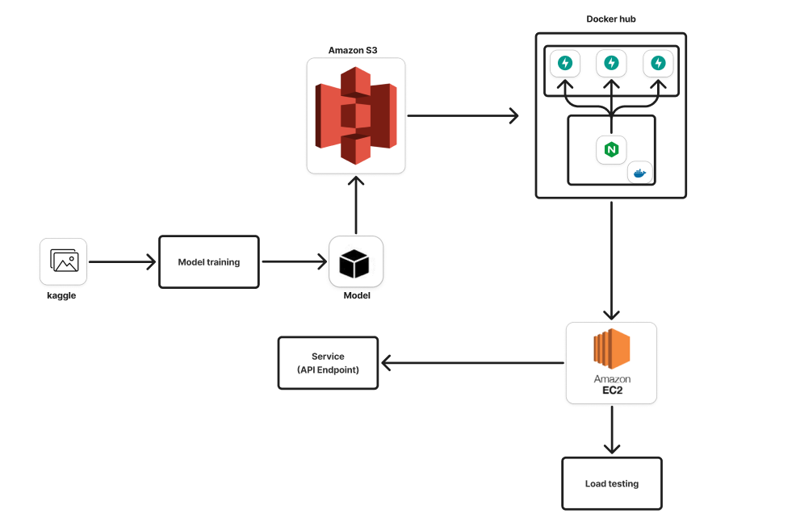

# Car Detection Deployment

This project provides a **car detection** API service using a pretrained YOLO model. It uses **FastAPI** – a modern, high-performance web framework – to serve object detection requests. The API accepts an image (via URL) and returns detected cars as an annotated image and confidence scores. The service is containerized with Docker and can be run with Docker Compose (using an Nginx reverse proxy). Under the hood, it downloads a YOLO model from an S3 bucket and runs inference with PyTorch, an open-source deep learning library.



## Features

- **Real-time Car Detection:** Detects cars in input images using a YOLO object detection model.  
- **REST API Endpoints:** Provides an HTTP GET endpoint (`/`) for health check and a POST endpoint (`/api/v1/object_detection`) that accepts an image URL for processing.  
- **JSON Input/Output:** Accepts JSON payload with image URLs and returns JSON with a base64-encoded image, detection scores, and latency.  
- **Dockerized Deployment:** Supports deployment with Docker and Docker Compose. Includes an Nginx container as a reverse proxy listening on port 80.  
- **Model Management via S3:** Downloads pretrained model weights from an AWS S3 bucket (`mlops-udemy-course-aws`). Uses `boto3` to fetch the model.  
- **Easy Extensibility:** The backend code is modular (FastAPI, Pydantic data models) making it easy to extend for additional functionality.


## Installation

1. **Clone the repository:**  
   ```bash
   git clone https://github.com/mahmuudtolba/car-detection-deployment.git
   cd car-detection-deployment
   ```
2. **Configure AWS credentials (optional):**  
   If running locally, ensure AWS credentials are available (e.g. in `~/.aws/credentials`) to allow downloading the model from S3. (The Docker setup binds `./.aws` to `/root/.aws`.)  
3. **Install Python dependencies (for local run):**  
   - Make sure you have Python 3.11+ installed.  
   - (Optional) Create and activate a virtual environment.  
   - Install required packages:  
     ```bash
     pip install -r requirements.txt
     ```
4. **Run with Uvicorn (local):**  
   ```bash
   python -m uvicorn app.app:app
   ```
5. **Run with Docker Compose (recommended):**  
   Ensure Docker and Docker Compose are installed, then run:  
   ```bash
   docker-compose up --build
   ```  

## Usage

- **Health Check:** Visit `GET /` to verify the service is running.  
- **Object Detection API:** Send a POST request to `/api/v1/object_detection` with a JSON body:
  ```json
  {
    "user_id": "user@example.com",
    "url": ["https://example.com/path/to/car_image.jpg"]
  }
  ```


## Project Structure

- **`app/`** – Application code  
- **`development-notebooks/`** – Jupyter notebooks for development  
- **`Dockerfile`**, **`Dockerfile.nginx`**, **`nginx.conf`** – Deployment files  
- **`docker-compose.yml`** – Multi-container orchestration  
- **`.dockerignore`, `.gitignore`** – Ignore rules  
- **`requirements.txt`** – Python dependencies

## Technologies Used

- **FastAPI**, **Uvicorn**, **YOLO (Ultralytics)**, **PyTorch**, **Python 3.11**, **Pydantic**, **AWS S3 / Boto3**, **Docker**, **Nginx**, **Pillow**, **Requests**


